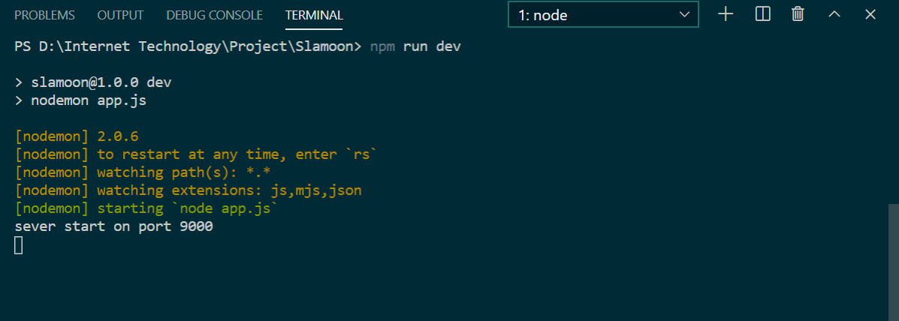
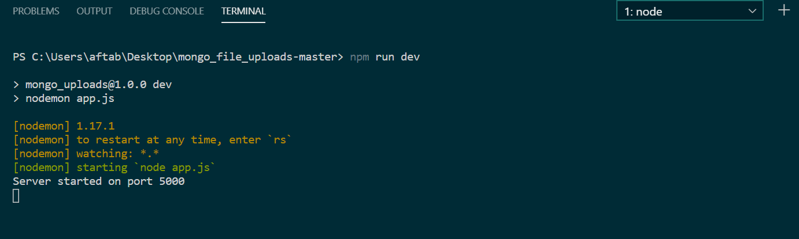

# Slamoon
A Website to write memories

## Requirment

  * NodeJs
  * MongoDB (Online MongoDB server can also be use)

## Functionalities

  * User registeration
    - Check for duplicate username
    - confirm password matching
  * User authentication and persistence session.
  * Profile photo- upload, update and delete.
  * Invite other user to fill the Book.
  * Write in other users book.
  * Notification alter if someone invited you.
  * Birthday alert of those who had written in you book.
   

**Make sure you have also downloaded [This project of Upload to MongoDB](https://github.com/aftabh4004/Upload-to-mongodb-Slamoon.git)**
I have used this project from [This project](https://github.com/bradtraversy/mongo_file_uploads.git) after making all the necessary changes. This is acting as a backend API handle the storing and retriving of image from the MongoDB.
Thanking @bradtraversy for this.

Both project should run in parallel in order to run the website smoothly.

**Main project on localhost:9000**

**Upload project on localhost:9000**

## Scope of improvment

  * Only .jpg image file is accepted
  * filter of duplicate notification
  * Order of birthday list
  * Deletion of attended notification
  * UI/UX
  * Implementing own module for MongoDB image upload.

